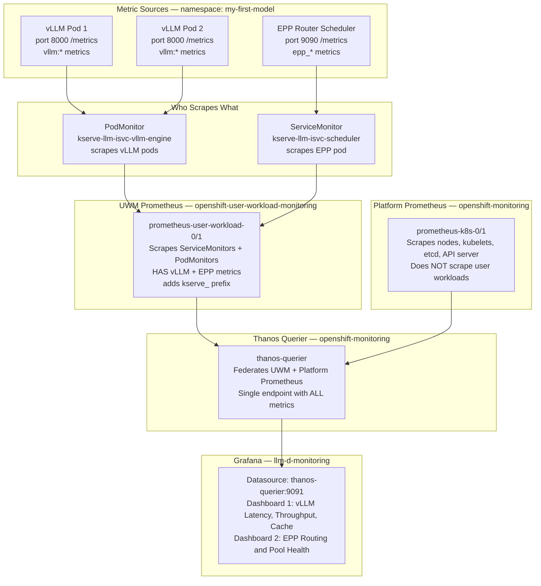

# How We Built an Observability Stack for llm-d on OpenShift AI

You've deployed a model on OpenShift AI using llm-d. It's running. You can curl it. But then you ask the obvious questions. How many requests is my model handling? What's my time-to-first-token? Is the KV cache filling up? Is the smart router actually distributing requests across replicas?

The platform doesn't answer these out of the box. The metrics are there — vLLM and the EPP both expose Prometheus endpoints — but there are no dashboards to visualize them.

This blog walks through everything we did to go from "no visibility" to "full Grafana dashboards showing every metric from the gateway to the model server."

## What We're Working With

We're running on ROSA (Red Hat OpenShift on AWS) with OpenShift AI 3.2.0. The Istio version is 1.26.2, pinned by RHOAI. Our model is Qwen/Qwen3-0.6B served by vLLM, with llm-d's EPP handling intelligent routing. We have 2 GPU nodes, each with an NVIDIA Tesla T4.

The LLMInferenceService operator automatically creates two vLLM pods (one per GPU), one EPP pod (the smart router), an InferencePool (groups the pods), and HTTPRoutes (URL routing rules).

Here is how a request flows from you to the model:

```
YOU                     GATEWAY POD               EPP POD             vLLM POD
 |                          |                        |                    |
 |---POST /v1/chat/----->   |                        |                    |
 |   completions            |                        |                    |
 |   (with JSON body)       |                        |                    |
 |                          |                        |                    |
 |                     1. Receives your request      |                    |
 |                     2. Matches the URL to an      |                    |
 |                        HTTPRoute rule             |                    |
 |                     3. Rule says: "this goes      |                    |
 |                        to InferencePool"          |                    |
 |                     4. Sends headers+body ------> |                    |
 |                        to EPP via ext-proc        |                    |
 |                                                   |                    |
 |                                              5. EPP scores            |
 |                                                 all vLLM pods         |
 |                                              6. Picks the best one    |
 |                                              7. Returns "use pod      |
 |                     8. Receives EPP's  <------   10.128.16.25"        |
 |                        decision                   |                    |
 |                     9. Forwards the FULL          |                    |
 |                        request (headers+body) -----------------------> |
 |                                                                   10. vLLM runs
 |                                                                       the model
 |                                                                   11. Returns
 |                     12. Forwards response <------------------------   tokens
 | <---response------- back to you                                       |
 |                          |                        |                    |
```

EPP scores every vLLM pod on three things and picks the one with the highest total score: queue depth (how many requests are waiting), KV cache usage (how full is GPU memory), and prefix cache (does this pod already have the prompt cached). Prefix cache gets the highest weight because a cache hit saves the most time.

All good in theory. Now let's make it visible.

## The Monitoring Architecture

Before installing anything, we needed to understand what was already running. OpenShift has two built-in Prometheus instances.

The first is Platform Prometheus. It scrapes cluster infrastructure — nodes, kubelets, API server. It knows nothing about your model.

The second is User Workload Monitoring (UWM) Prometheus. It scrapes ServiceMonitors and PodMonitors in user namespaces. This is where your vLLM and EPP metrics live.

Then there is Thanos Querier, which sits in front of both and gives you a single unified query endpoint. This is what Grafana needs to talk to.



The key insight: you don't need to install Prometheus. It's already there. You just need Grafana to point to Thanos Querier with the right authentication.

## Setting Up Grafana — Step by Step

OpenShift's built-in Grafana is read-only, so we installed our own using the Grafana Operator from OperatorHub. Everything is deployed declaratively using Custom Resources. Here are the steps.

Step 1: Create a dedicated namespace.

```yaml
apiVersion: v1
kind: Namespace
metadata:
  name: llm-d-monitoring
```

Step 2: Create the Grafana instance with an OpenShift Route for HTTPS access.

```yaml
apiVersion: grafana.integreatly.org/v1beta1
kind: Grafana
metadata:
  name: llm-d-grafana
  namespace: llm-d-monitoring
  labels:
    dashboards: llm-d-grafana
spec:
  config:
    auth:
      disable_login_form: "false"
    security:
      admin_user: admin
      admin_password: admin123
  route:
    spec:
      tls:
        termination: edge
```

Step 3: Create a ServiceAccount with a permanent token. This is what Grafana uses to authenticate with Thanos Querier.

```yaml
apiVersion: v1
kind: ServiceAccount
metadata:
  name: grafana-thanos
  namespace: llm-d-monitoring
---
apiVersion: v1
kind: Secret
metadata:
  name: grafana-thanos-token
  namespace: llm-d-monitoring
  annotations:
    kubernetes.io/service-account.name: grafana-thanos
type: kubernetes.io/service-account-token
```

Step 4: Grant the ServiceAccount permission to read cluster-wide metrics.

```yaml
apiVersion: rbac.authorization.k8s.io/v1
kind: ClusterRoleBinding
metadata:
  name: grafana-thanos-cluster-monitoring-view
roleRef:
  apiGroup: rbac.authorization.k8s.io
  kind: ClusterRole
  name: cluster-monitoring-view
subjects:
  - kind: ServiceAccount
    name: grafana-thanos
    namespace: llm-d-monitoring
```

Step 5: Create the GrafanaDatasource pointing to Thanos Querier. Replace `TOKEN_PLACEHOLDER` with the actual token from the Secret created in Step 3.

```yaml
apiVersion: grafana.integreatly.org/v1beta1
kind: GrafanaDatasource
metadata:
  name: thanos-querier
  namespace: llm-d-monitoring
spec:
  instanceSelector:
    matchLabels:
      dashboards: llm-d-grafana
  datasource:
    name: Prometheus
    type: prometheus
    uid: prometheus
    access: proxy
    url: https://thanos-querier.openshift-monitoring.svc:9091
    isDefault: true
    jsonData:
      tlsSkipVerify: true
      httpHeaderName1: Authorization
    secureJsonData:
      httpHeaderValue1: "Bearer TOKEN_PLACEHOLDER"
```

To extract the token and inject it automatically:

```
TOKEN=$(oc get secret grafana-thanos-token -n llm-d-monitoring \
  -o jsonpath='{.data.token}' | base64 -d)
sed "s|TOKEN_PLACEHOLDER|${TOKEN}|g" 05-datasource.yaml | oc apply -f -
```

## Deploying the Dashboards

We deployed two dashboards, each showing a different layer of the stack.

The first is the vLLM Latency, Throughput, and Cache dashboard. It comes from the [llm-d-deployer](https://github.com/llm-d/llm-d-deployer) repo. It has 13 panels covering end-to-end request latency (p50/p95/p99), time-to-first-token, time-per-output-token, running and pending requests, KV cache usage, token throughput, and error rates.

The second is the EPP Routing and Pool Health dashboard. This comes from the upstream Gateway API Inference Extension project. It shows request rate by model, routing decision duration, ready pod count, average KV cache utilization, and average queue size across the pool.

Both dashboards are deployed as GrafanaDashboard Custom Resources backed by ConfigMaps. The setup script handles creating the ConfigMaps and applying the CRs.

## Generating Traffic and Lighting Up the Dashboards

With Grafana running, we used GuideLLM to generate traffic. The important thing is to point GuideLLM at the gateway URL, not directly at vLLM. If you target vLLM directly, only the vLLM dashboard gets data. The EPP dashboard stays empty because EPP was never involved.

GuideLLM ran 10 benchmark strategies over 12 minutes, generating 6,123 requests. EPP distributed them nearly 50/50 across both vLLM pods.

The vLLM dashboard showed latency curves climbing as concurrency increased, KV cache usage building under sustained load, and token throughput peaking around 17.6 requests per second. The EPP dashboard showed request distribution across pods, sub-millisecond routing decisions, and both replicas healthy.

## Try It Yourself

We've open-sourced all the manifests, setup scripts, and documentation.

> Repository: [github.com/nirjhar17/llm-d-observability-openshift](https://github.com/nirjhar17/llm-d-observability-openshift)

The repo includes a one-command `setup.sh` that deploys the full Grafana stack, a `teardown.sh` for clean removal, all 8 Kubernetes manifests (namespace, Grafana instance, ServiceAccount, RBAC, datasource, both dashboards, and the EnvoyFilter fix), plus a detailed request flow guide.

```
git clone https://github.com/nirjhar17/llm-d-observability-openshift.git
cd llm-d-observability-openshift
./setup.sh
```

You'll need an OpenShift cluster with RHOAI, a model deployed via LLMInferenceService, the Grafana Operator installed, and User Workload Monitoring enabled.

## About Me

I work on OpenShift, OpenShift AI, and observability solutions, focusing on simplifying complex setups into practical, repeatable steps for platform and development teams.

GitHub: [github.com/nirjhar17](https://github.com/nirjhar17)

LinkedIn: [linkedin.com/in/nirjhar-jajodia](https://linkedin.com/in/nirjhar-jajodia)

## Disclaimer

The views and opinions expressed in this article are my own and do not necessarily reflect the official policy or position of my employer. This guide is provided for educational purposes, and I make no warranties about the completeness, reliability, or accuracy of this information.
