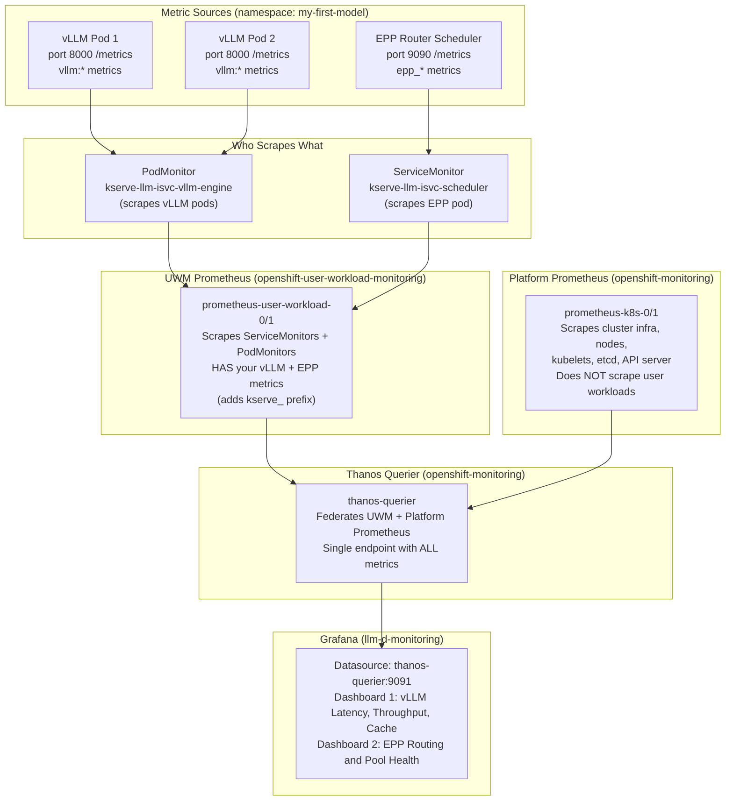

# How We Built an Observability Stack for llm-d on OpenShift AI

You've deployed a model on OpenShift AI using llm-d. It's running. You can curl it. But then you ask the obvious questions. How many requests is my model handling? What's my time-to-first-token? Is the KV cache filling up? Is the smart router actually distributing requests across replicas?

The platform doesn't answer these out of the box. The metrics are there — vLLM and the EPP both expose Prometheus endpoints — but there are no dashboards to visualize them.

This blog walks through everything we did to go from "no visibility" to "full Grafana dashboards showing every metric from the gateway to the model server."

## What We're Working With

We're running on ROSA (Red Hat OpenShift on AWS) with OpenShift AI 3.2.0. The Istio version is 1.26.2, pinned by RHOAI. Our model is Qwen/Qwen3-0.6B served by vLLM, with llm-d's EPP handling intelligent routing. We have 2 GPU nodes, each with an NVIDIA Tesla T4.

The LLMInferenceService operator automatically creates two vLLM pods (one per GPU), one EPP pod (the smart router), an InferencePool (groups the pods), and HTTPRoutes (URL routing rules).

Here is how a request flows from you to the model:

```
YOU                     GATEWAY POD               EPP POD             vLLM POD
 |                          |                        |                    |
 |---POST /v1/chat/----->   |                        |                    |
 |   completions            |                        |                    |
 |   (with JSON body)       |                        |                    |
 |                          |                        |                    |
 |                     1. Receives your request      |                    |
 |                     2. Matches the URL to an      |                    |
 |                        HTTPRoute rule             |                    |
 |                     3. Rule says: "this goes      |                    |
 |                        to InferencePool"          |                    |
 |                     4. Sends headers+body ------> |                    |
 |                        to EPP via ext-proc        |                    |
 |                                                   |                    |
 |                                              5. EPP scores            |
 |                                                 all vLLM pods         |
 |                                              6. Picks the best one    |
 |                                              7. Returns "use pod      |
 |                     8. Receives EPP's  <------   10.128.16.25"        |
 |                        decision                   |                    |
 |                     9. Forwards the FULL          |                    |
 |                        request (headers+body) -----------------------> |
 |                                                                   10. vLLM runs
 |                                                                       the model
 |                                                                   11. Returns
 |                     12. Forwards response <------------------------   tokens
 | <---response------- back to you                                       |
 |                          |                        |                    |
```

EPP scores every vLLM pod on three things and picks the one with the highest total score: queue depth (how many requests are waiting), KV cache usage (how full is GPU memory), and prefix cache (does this pod already have the prompt cached). Prefix cache gets the highest weight because a cache hit saves the most time.

All good in theory. Now let's make it visible.

## The Monitoring Architecture

Before installing anything, we needed to understand what was already running. OpenShift has two built-in Prometheus instances.

The first is Platform Prometheus. It scrapes cluster infrastructure — nodes, kubelets, API server. It knows nothing about your model.

The second is User Workload Monitoring (UWM) Prometheus. It scrapes ServiceMonitors and PodMonitors in user namespaces. This is where your vLLM and EPP metrics live.

Then there is Thanos Querier, which sits in front of both and gives you a single unified query endpoint. This is what Grafana needs to talk to.



The key insight: you don't need to install Prometheus. It's already there. You just need Grafana to point to Thanos Querier with the right authentication.

## Setting Up Grafana

OpenShift's built-in Grafana is read-only, so we installed our own using the Grafana Operator from OperatorHub.

We created a dedicated namespace called `llm-d-monitoring` and deployed everything declaratively using Custom Resources. This included a Grafana instance with an OpenShift Route for HTTPS access, a ServiceAccount with a permanent token for Thanos authentication, a ClusterRoleBinding for monitoring permissions, and a GrafanaDatasource pointing to Thanos Querier.

One thing worth noting for AWS STS clusters: the Grafana Operator asks for an IAM Role ARN during installation. It doesn't actually need any AWS permissions. Just create an empty role and provide that ARN.

We automated the entire setup in a `setup.sh` script that reads the ServiceAccount token from the Secret, injects it into the datasource YAML, and applies everything in the right order.

## Deploying the Dashboards

We deployed two dashboards, each showing a different layer of the stack.

The first is the vLLM Latency, Throughput, and Cache dashboard. This is Sally O'Malley's dashboard from the llm-d-deployer repo. It has 13 panels covering end-to-end request latency (p50/p95/p99), time-to-first-token, time-per-output-token, running and pending requests, KV cache usage, token throughput, and error rates.

The second is the EPP Routing and Pool Health dashboard. This comes from the upstream Gateway API Inference Extension project. It shows request rate by model, routing decision duration, ready pod count, average KV cache utilization, and average queue size across the pool.

Both dashboards needed a critical fix before they would work.

## The Metric Prefix Gotcha

Here's something that will trip you up: RHOAI adds a `kserve_` prefix to all vLLM metrics.

Standard vLLM exposes metrics like `vllm:e2e_request_latency_seconds`. On OpenShift AI, the same metric becomes `kserve_vllm:e2e_request_latency_seconds`. The ServiceMonitor adds this prefix during scraping.

If you import any community dashboard that uses `vllm:*` queries, every panel shows "No data." You need to run a simple sed replacement on the dashboard JSON before deploying it.

```
sed 's/vllm:/kserve_vllm:/g' dashboard.json
```

We also had to replace the Grafana datasource variable with our actual datasource UID, and fix the EPP dashboard's `inference_pool_` references to `kserve_inference_pool_`. This isn't documented anywhere obvious — you discover it by querying Thanos directly and seeing what metric names actually exist.

## The Bug — POST Requests Were Silently Broken

With dashboards deployed, we fired up GuideLLM to generate traffic. But something was wrong.

GET requests worked fine. Hitting `/v1/models` through the gateway returned 200 with the model list.

POST requests failed. Hitting `/v1/chat/completions` through the gateway returned 400 with "Field required." The request body was vanishing somewhere between the gateway and vLLM.

POST requests directly to vLLM worked perfectly. The model was fine. The body was being eaten in transit.

We traced it through Envoy access logs. The gateway received all 89 bytes of the JSON body. It sent the request to EPP via the ext-proc filter. EPP picked the best pod. Then Envoy forwarded the request to vLLM — without the body.

The root cause was the ext-proc filter's body processing mode. Istio 1.26.2 configured it as FULL_DUPLEX_STREAMED, a newer streaming mode that has a bug. It sends the body to the external processor but never forwards it to the backend. The body gets "eaten."

This is fixed in Istio 1.27+. But we couldn't upgrade.

## Why We Couldn't Upgrade Istio

We tried patching the Istio CR directly to v1.27.3. The Sail operator reverted it within seconds.

We tried removing the ownerReferences from the CR. Sail re-added them and reverted.

We scaled down the RHOAI operator. That didn't help, because Sail (not RHOAI) controls the Istio version.

We checked for newer RHOAI versions. Already on the latest 3.2.0.

The version is tightly controlled by the operator chain. Direct patching is not an option.

## The Fix — One EnvoyFilter

We applied an EnvoyFilter — a Kubernetes resource that patches Envoy's configuration directly without modifying operator-managed resources. It changes the body mode from FULL_DUPLEX_STREAMED to BUFFERED for the specific routes that go through the InferencePool.

> Before the fix: POST /v1/chat/completions → 400 "Field required"
> After the fix: POST /v1/chat/completions → 200 OK (model responds!)

One YAML file. One `oc apply`. Bug fixed. The EnvoyFilter persists across pod restarts and cluster reboots. When a future RHOAI release ships Istio 1.27+, it can be safely removed.

## Generating Traffic and Lighting Up the Dashboards

With the bug fixed, we ran GuideLLM as a Kubernetes Job, pointing it at the gateway URL — not directly at vLLM. This distinction is crucial. If you target vLLM directly, only the vLLM dashboard gets data. The EPP dashboard stays empty because EPP was never involved.

GuideLLM ran 10 benchmark strategies over 12 minutes, generating 6,123 requests. EPP distributed them nearly 50/50 across both vLLM pods.

The vLLM dashboard showed latency curves climbing as concurrency increased, KV cache usage building under sustained load, and token throughput peaking around 17.6 requests per second. The EPP dashboard showed request distribution across pods, sub-millisecond routing decisions, and both replicas healthy.

## Six Things We Learned the Hard Way

The kserve_ prefix will bite you. Any community dashboard or PromQL query needs `vllm:` replaced with `kserve_vllm:` on RHOAI. Same for EPP metrics. This is the most common reason for "No data" panels.

The Grafana Operator makes everything reproducible. Define your Grafana instance, datasource, and dashboards as Kubernetes CRs. The entire stack deploys with one script and tears down with another.

Always test through the gateway, not around it. Our initial GuideLLM runs bypassed the gateway and hit vLLM directly. The EPP dashboard was blank. You must send traffic through the full path: Gateway → EPP → vLLM.

The body-forwarding bug was completely silent. GET requests worked. Only POST requests (chat completions) failed. If you only test with GET, you'll think everything is fine.

The Envoy access log is your best debugging tool. It shows every request's HTTP method, path, status code, upstream pod, body size, and response time. If body size is 0 on a POST, the body was stripped.

Model names are tricky. The URL path uses the Kubernetes name (`qwen3-0-6b`), but the "model" field in the JSON body must use the HuggingFace name (`Qwen/Qwen3-0.6B`). Mix them up and you get a 404.

## Try It Yourself

We've open-sourced all the manifests, setup scripts, and documentation.

> Repository: [github.com/nirjhar17/llm-d-observability-openshift](https://github.com/nirjhar17/llm-d-observability-openshift)

The repo includes a one-command `setup.sh` that deploys the full Grafana stack, a `teardown.sh` for clean removal, all 8 Kubernetes manifests (namespace, Grafana instance, ServiceAccount, RBAC, datasource, both dashboards, and the EnvoyFilter fix), plus a detailed request flow guide.

```
git clone https://github.com/nirjhar17/llm-d-observability-openshift.git
cd llm-d-observability-openshift
./setup.sh
```

You'll need an OpenShift cluster with RHOAI, a model deployed via LLMInferenceService, the Grafana Operator installed, and User Workload Monitoring enabled.

## What's Next

When RHOAI ships Istio 1.27+, the EnvoyFilter workaround can be removed. The current EPP version doesn't emit all upstream metrics yet, so some dashboard panels remain empty. And we still need to apply the EnvoyFilter to the maas-gateway for authenticated production traffic.

The natural next step is Prometheus alerting — for example, alerting when KV cache usage exceeds 80% or when error rates spike.

If you're running llm-d on OpenShift AI, the metrics are already flowing. You just need to connect the dots. We hope this saves you the debugging time it cost us.

*All manifests, scripts, and guides are available at [github.com/nirjhar17/llm-d-observability-openshift](https://github.com/nirjhar17/llm-d-observability-openshift). Built on Red Hat OpenShift AI 3.2.0, ROSA ap-southeast-1.*

## About Me

I work on OpenShift, OpenShift AI, and observability solutions, focusing on simplifying complex setups into practical, repeatable steps for platform and development teams.

GitHub: [github.com/nirjhar17](https://github.com/nirjhar17)

LinkedIn: [linkedin.com/in/nirjhar-jajodia](https://linkedin.com/in/nirjhar-jajodia)

## Disclaimer

The views and opinions expressed in this article are my own and do not necessarily reflect the official policy or position of my employer. This guide is provided for educational purposes, and I make no warranties about the completeness, reliability, or accuracy of this information.
